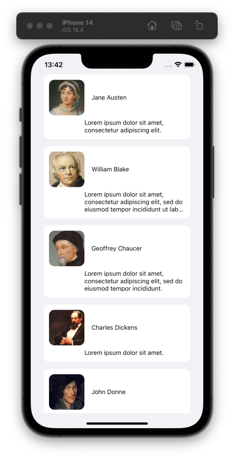
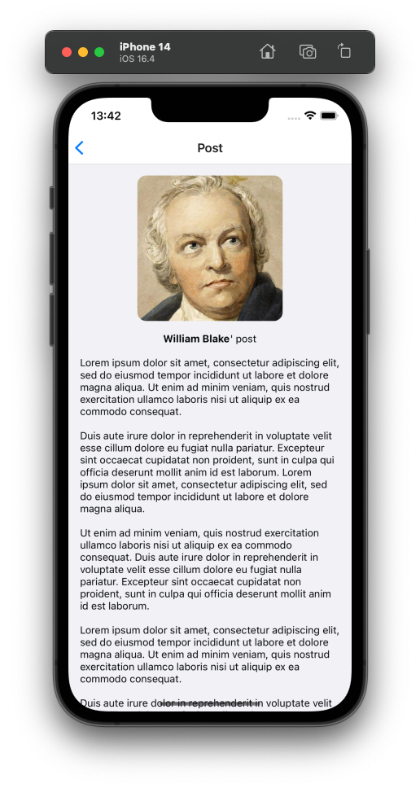
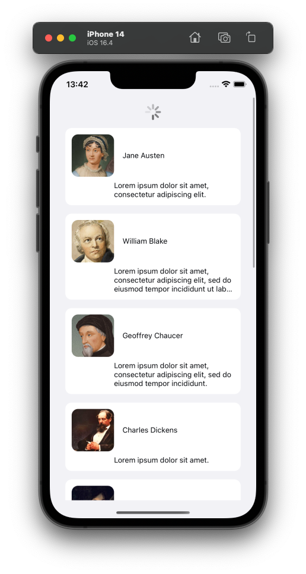

# react-native-simple-app
A simple react native project that consists of:
1) A home page with a list of 'posts', with the infinite scroll view and drag to refresh capability.
2) Click the post to navigate to the post's page.
3) Click the author's name or photo to navigate to author's profile page.

## Environment
```shell
"npm": "8.11.0", # Globally installed
"node": "^16", # Globally installed
"yarn": "1.22.19", # Globally installed
"react": "18.2.0",
"react-native": "0.71.11",
```

## Install dependencies

```shell
nvm use 16
npm install --global yarn # Or use npx before each yarn command

# Install dependencies, start metro bundler and build app
yarn clean-start
yarn ios # Will run application to latest iPhone simulator
```

## App functionality

### Home screen

### Profile screen

### Refresh

### Infinite scroll - Get next page

